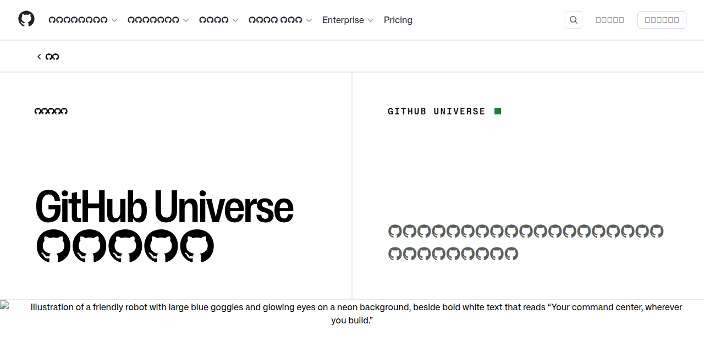

<!-- _class: title -->
<!-- _paginate: false -->

# GitHub Copilot &amp; GitHub 最新アップデート

GitHub Universe 2025 以降の動向まとめ

2026年3月

---

<!-- _paginate: false -->

## 大平かづみ / Kazumi OHIRA

- GitHub Star 🌟
- 株式会社オルターブース所属
- GitHub公認トレーナー
- 得意な領域
  - Infrastructure as Code
  - GitHub Actions による自動化
- 技術コミュニティ
  - [Code Polaris](https://code-polaris.connpass.com) / [GitHub dockyard](https://github-dockyard.connpass.com)

𝕏 [@dz_](https://x.com/dz_)
🐙 [@dzeyelid](https://github.com/dzeyelid)
▶️ [@dzeyelid](https://www.youtube.com/@dzeyelid)
💬 [dzeyelid](https://www.twitch.tv/dzeyelid)

---

<!-- _paginate: false -->

## アジェンダ

1. **GitHub Copilot の概要**
2. **GitHub Universe 2025 の発表とその後の動向**
3. **GitHub Copilot アップデート情報のピックアップ**
　（GitHub Universe 2025 以降）
4. **その他の GitHub 関連情報のピックアップ**

---

<!-- _class: chapter -->
<!-- _paginate: false -->

# 1
## GitHub Copilot の概要

---

## GitHub Copilot とは

> *"GitHub Copilot is an AI coding assistant that helps you write code faster and with less effort. Then, you can focus more energy on problem solving and collaboration."*
> — docs.github.com

### 利用できる場所
- **IDE**：VS Code、Visual Studio、JetBrains IDE、Eclipse、Xcode、Vim/Neovim
- **GitHub.com**（Web）
- **GitHub Mobile**（チャットインターフェース）
- **コマンドライン**：GitHub CLI（Copilot CLI）

> 参考: [What is GitHub Copilot? - GitHub Docs](https://docs.github.com/en/copilot/about-github-copilot/what-is-github-copilot)

---

## 主な機能

### 💻 IDE 上で使う機能
- **Inline suggestion**：ワークスペースからコンテキストを読み取り、次のコードをリアルタイムに提案
- **Copilot Chat**：自然言語で質問・設計相談・コード生成を依頼（Ask/Planモード）

### 🌐 GitHub.com で使う機能
- **Copilot Chat**（GitHub.com）：Web 上でGitHub Copilotに質問できる
- **Copilot Spaces**：コンテキストを整理・共有してより関連性の高い回答を取得

> 参考: [GitHub Copilot features - GitHub Enterprise Cloud Docs](https://docs.github.com/en/enterprise-cloud@latest/copilot/get-started/features)

---

## エージェントとして使う主な機能

### 🧭 Copilot Chat の Agent モード
- VS Code などの IDE で、自然言語の依頼から複数ステップの実装を進める
- Ask / Plan よりも自律性が高く、ファイル編集やツール実行まで踏み込める

### 🤖 Copilot coding agent
- GitHub.com や Issue アサインなどから依頼し、バックグラウンドで自律的に実装
- 進捗確認、追加指示、差分確認をしながらタスクを進められる

### 🔍 Copilot code review
- プルリクエストの差分を Copilot にレビューさせ、問題点や改善候補を洗い出す
- IDE 上では任意の差分に対してレビューを依頼できる

> 参考: [GitHub Copilot features - GitHub Enterprise Cloud Docs](https://docs.github.com/en/enterprise-cloud@latest/copilot/get-started/features)

---

## 利用プランの概要

| プラン | 対象 | 主な特徴 |
|--------|------|----------|
| **Copilot Free** | 個人（無料） | 限定的な機能・リクエスト数で AI コーディングを体験 |
| **Copilot Student** | 学生（無料） | 無制限の補完、プレミアムモデル、coding agent |
| **Copilot Pro** | 個人（有料） | 無制限の補完、プレミアムモデル、coding agent |
| **Copilot Pro+** | 個人（有料） | Pro の全機能 ＋ より多いプレミアムリクエスト、全モデルアクセス |
| **Copilot Business** | 組織 | coding agent、集中管理・ポリシー制御 |
| **Copilot Enterprise** | 大規模企業 | Business の全機能 ＋ エンタープライズグレードの機能 |

- 教員・OSS メンテナーは Copilot Pro への無料アクセスが得られる場合あり
- **Copilot Student** プランは、GitHub Education の特典からプランとして切り出された（2026年3月〜）

> 参考: [Plans for GitHub Copilot](https://docs.github.com/en/copilot/about-github-copilot/subscription-plans-for-github-copilot)

---

## プレミアムリクエストとは

- **プレミアムリクエスト**：GPT-4o、Claude Sonnet、Gemini などの高性能モデルへのリクエスト
  - デフォルトモデル（GPT-4.1 mini 相当）への補完や基本チャットはカウント対象外
- プランごとに月ごとの上限が異なる

| プラン | 月間プレミアムリクエスト数 |
|--------|--------------------------|
| **Copilot Free** | 50 回 |
| **Copilot Student** | 500 回 |
| **Copilot Pro** | 300 回 |
| **Copilot Pro+** | 1,500 回 |
| **Copilot Business** | 300 回 / ユーザー |
| **Copilot Enterprise** | 1,000 回 / ユーザー |

- 上限を超えた場合は追加購入（$0.04 / リクエスト）または低速レート制限に切り替わる

> 参考: [Plans for GitHub Copilot](https://docs.github.com/en/copilot/about-github-copilot/subscription-plans-for-github-copilot)

---

<!-- _class: chapter -->
<!-- _paginate: false -->

# 2
## GitHub Universe 2025 の発表と その後の動向

---

## GitHub Universe 2025 とは

- **開催日**：2025年10月28〜29日
- **場所**：Fort Mason Center, San Francisco
- GitHub が年に一度開催する開発者向けカンファレンス
- 🔗 [githubuniverse.com](https://githubuniverse.com)

### コンテンツトラック（3つ）
1. 🚀 **Build faster, stay in flow** — AI ネイティブツールで開発ライフサイクルを変革
2. 🔐 **Secure every commit** — AI 活用の脆弱性検出とシームレスなセキュリティ
3. ⚡ **Automate and scale with confidence** — CI/CD 最適化と GitHub Copilot の ROI 測定

> 参考: [GitHub Universe 2025: Here’s what’s in store at this year’s developer wonderland](https://github.blog/news-insights/company-news/github-universe-2025-heres-whats-in-store-at-this-years-developer-wonderland/)

---

## GitHub Universe 2025 発表まとめ

全発表のまとめは公式レポートページへ：

🔗 **https://github.com/events/universe/recap?locale=ja**

基調講演・セッション・デモのハイライトを日本語でご覧いただけます。

---

## Universe 2025 発表（1）：Mission Control

### Copilot coding agent のタスク管理を刷新
- セッションログを **Overview** / **Files changed** タブの横に表示
- コミットの根拠をリアルタイムで確認しながら進捗をモニタリング

### リアルタイムステアリング
- エージェントが動作中でも **リアルタイムにログ** を確認できる
- チャット入力、または Files changed ビュー内のコメントから直接フィードバック

### タスク管理の集約
- タスクステータスを一覧で把握、Copilot が確認を求める際に素早く対応
- Codespaces・VS Code・GitHub CLI からシームレスに作業継続

> 参考: [A mission control to assign, steer, and track Copilot coding agent tasks](https://github.blog/changelog/2025-10-28-a-mission-control-to-assign-steer-and-track-copilot-coding-agent-tasks/)

---

## Universe 2025 発表（2）：カスタムエージェント

### `.github/agents` 設定ファイルでエージェントをカスタマイズ
- リポジトリまたは組織の `.github/agents` にマークダウンの設定ファイルを追加
- エージェントのペルソナ・プロンプト・ツール選択・MCP サーバーを定義

### 主なメリット
- チームのワークフロー・規約・ニーズに特化したエージェントを定義
- 組織固有・チーム固有のエージェントを共有リポジトリで管理
- Copilot coding agent（github.com）、Copilot CLI で動作（VS Code は今後対応）

### 活用例
- Frontend エンジニア向けサブエージェント（React/Vue の規約を強制）
- GitHub CLI の MCP を使ってカスタムタスクを自動化するエージェント

> 参考: [Custom agents for GitHub Copilot](https://github.blog/changelog/2025-10-28-custom-agents-for-github-copilot/)

---

## Universe 2025 発表（3）：Slack 連携 / コード品質

### Copilot coding agent × Slack
- Slack の GitHub アプリで `@GitHub` にメンションするだけで PR を生成
- Microsoft Teams との連携も GA 済み（2025年9月〜）
- Jira、Azure Boards からも Copilot にタスクを割り当て可能

### GitHub Code Quality（パブリックプレビュー）
- PR をコード品質改善の機会に変換
- CodeQL ベースの品質ルールで保守性・信頼性の問題を検出
  - 対応言語：Java、C#、Python、JavaScript、Go、Ruby
- **ワンクリック Copilot 修正**でインライン表示の指摘をすぐに対処
- 信頼性・保守性スコアで技術的負債の優先順位を把握

> 参考: [Work with Copilot coding agent in Slack](https://github.blog/changelog/2025-10-28-work-with-copilot-coding-agent-in-slack/) / [GitHub Code Quality in public preview](https://github.blog/changelog/2025-10-28-github-code-quality-in-public-preview/)

---

## Universe 2025 発表（4）：Copilot code review

### Copilot code review の機能追加
- PR 全体の文脈を踏まえた **エージェンティックコードレビュー** を提供
- モデルの推論と CodeQL を組み合わせ、品質上の問題をより広く検出
- 修正提案の適用まで含めて、レビューの自動化を強化

> 参考: [GitHub Universe 2025 Recap](https://github.com/events/universe/recap?locale=ja) / [New public preview features in Copilot code review](https://github.blog/changelog/2025-10-28-new-public-preview-features-in-copilot-code-review-ai-reviews-that-see-the-full-picture/)

---

## Universe 2025 発表（5）：Plan モード / MCP

### Plan モード
- VS Code 上で、コードを書く前に **ステップバイステップの実装計画** を策定
- 実装に入る前に、進め方や論点を確認して可視性と制御性を高める
- AGENTS.md と組み合わせて、チームのルールに沿った進行も可能

### GitHub MCP Registry
- GitHub MCP Registry から MCP サーバーを検索・導入可能
- VS Code 内で MCP インテグレーションをより簡単にセットアップ
- エージェントの外部ツール連携を標準的な方法で拡張

> 参考: [GitHub Universe 2025 Recap](https://github.com/events/universe/recap?locale=ja) / [GitHub Copilot in Visual Studio Code gets upgraded](https://github.blog/changelog/2025-10-28-github-copilot-in-visual-studio-code-gets-upgraded/)

---

<!-- _class: chapter -->
<!-- _paginate: false -->

# 3
## GitHub Copilot アップデート情報のピックアップ
### （GitHub Universe 2025 以降）

---

## 2025年12月のアップデート

### Copilot Memory（プレビュー）
- Copilot Pro / Pro+ 向けにパブリックプレビュー開始
- coding agent とコードレビューでリポジトリ固有のメモリをサポート
- コードベースから重要な知見を蓄積し、エージェントの精度を向上

### Agent Skills
- **Agent Skills**：タスクを特定・繰り返し可能な方法で実行するよう Copilot に教える仕組み
- スキルはフォルダー構成（インストラクション・スクリプト・リソース）
- プロンプトに関連すると判断したとき自動的にロード
- coding agent・Copilot CLI・VS Code のエージェントモードで動作

### API から Issue を Copilot にアサイン
- GraphQL・REST API 経由でイシューを Copilot にアサイン可能に

> 参考: [Copilot memory early access for Pro and Pro+](https://github.blog/changelog/2025-12-19-copilot-memory-early-access-for-pro-and-pro/) / [GitHub Copilot now supports Agent Skills](https://github.blog/changelog/2025-12-18-github-copilot-now-supports-agent-skills/)

---

## 2026年1月のアップデート

### Agents タブ（リポジトリ内）
- Copilot coding agent のタスク管理がリポジトリ内の **Agents タブ** に統合
- コード・PR・イシューと並んでセッションを管理
- セッションログのグルーピングが改善、ファイル変更の diff をワンクリックで展開
- **Copilot CLI** でセッションを継続する機能を追加

### Copilot SDK（テクニカルプレビュー）
- Copilot CLI へのプログラムアクセスを提供する言語別 SDK
- 対応言語：**Node.js / Python / Go / .NET**

### ACP（Agent Client Protocol）のサポート（Copilot CLI）
- AI エージェントとクライアント間の業界標準プロトコルを実装
- サードパーティツール・IDE・自動化システムから Copilot CLI を統合可能に

> 参考: [Introducing the Agents tab in your repository](https://github.blog/changelog/2026-01-26-introducing-the-agents-tab-in-your-repository/) / [Copilot SDK in technical preview](https://github.blog/changelog/2026-01-14-copilot-sdk-in-technical-preview/)

---

## 2026年2月のアップデート

### Copilot CLI — GA（2026年2月25日）
- ターミナルネイティブなコーディングエージェントとして **正式リリース**
- Plan モード / Autopilot モード / 内蔵専門エージェント（Explore・Task・Code Review 等）
- MCP・プラグイン・Agent Skills でカスタマイズ可能
- セッションを超えた **リポジトリメモリ**（過去のコンテキストを記憶）
- macOS / Linux / Windows 対応、GitHub Codespaces にも標準搭載

### Copilot メトリクス — GA
- Copilot の採用状況・利用トレンドを一元管理

### Web 上の Copilot での Web 検索改善
- 特定モデルでモデルネイティブの Web 検索が利用可能に

> 参考: [GitHub Copilot CLI is now generally available](https://github.blog/changelog/2026-02-25-github-copilot-cli-is-now-generally-available/)

---

## 2026年2月のアップデート（続き）

### Copilot coding agent — Windows プロジェクト対応
- Windows プロジェクトで Copilot coding agent が利用可能に

### Copilot coding agent — コード参照対応
- エージェントが生成したコードがパブリックリポジトリのコードと一致する場合、一致したコードのリンクを表示

### Visual Studio — January Update（2026年2月4日公開）
- Copilot Chat の構文ハイライト付き補完
- 部分的なコード提案の承認（Partial Acceptance）
- デバッグ・テスト・モダナイゼーション連携の強化

> 参考: [Use Copilot coding agent with Windows projects](https://github.blog/changelog/2026-02-18-use-copilot-coding-agent-with-windows-projects/) / [Copilot coding agent supports code referencing](https://github.blog/changelog/2026-02-18-copilot-coding-agent-supports-code-referencing/)

---

## 2026年3月のアップデート（1）

### GPT-5.4 — GA（2026年3月5日）
- OpenAI の最新エージェントコーディングモデル
- 実世界・エージェント・ソフトウェア開発タスクで新たな成功率を達成
- 強化された論理推論と複雑なマルチステップタスクの実行能力
- VS Code / Visual Studio / JetBrains / Xcode / Eclipse / github.com / GitHub Mobile / CLI / coding agent で利用可能

### エージェントセッションへの画像追加（2026年3月5日）
- github.com の Agents タブなどで画像からエージェントセッションを開始
- ペースト・ドラッグ&ドロップ・アイコンクリックで画像を添付

### Visual Studio — February Update（2026年3月4日公開）
- 拡張されたエージェント機能
- よりスマートな inline suggestion
- デバッグ・テスト・モダナイゼーションワークフロー全体への深い統合

> 参考: [GPT-5.4 is generally available in GitHub Copilot](https://github.blog/changelog/2026-03-05-gpt-5-4-is-generally-available-in-github-copilot/)

---

## 2026年3月のアップデート（2）

### GPT-5.3-Codex — LTS（長期サポート）モデル（2026年3月18日）
- エンタープライズ向けに **12ヶ月間** の安定サポートを保証
- 2026年2月5日リリース → 2027年2月4日まで Business / Enterprise で利用可能
- GPT-4.1 に替わる **新しいベースモデル** として採用
- エンタープライズで高いコードサバイバルレートを記録

> 参考: [GPT-5.3-Codex long-term support in GitHub Copilot](https://github.blog/changelog/2026-03-18-gpt-5-3-codex-long-term-support-in-github-copilot/)

---

## 2026年3月のアップデート（3）

### Copilot coding agent の検証ツール設定（2026年3月18日）
- coding agent がコードを書いたとき自動的に以下を実行：
  - プロジェクトのテスト・リンター
  - CodeQL・GitHub Advisory Database・シークレットスキャン・Copilot コードレビュー
- **リポジトリ管理者**が実行する検証ツールを設定できるように

### GitHub CLI から Copilot コードレビューをリクエスト（2026年3月11日）
- `gh pr edit --add-reviewer @copilot` でターミナルから直接 Copilot にレビューを依頼

> 参考: [Configure Copilot coding agent’s validation tools](https://github.blog/changelog/2026-03-18-configure-copilot-coding-agents-validation-tools/)

---

## 2026年3月のアップデート（4）

### Copilot Student プラン（2026年3月13日）
- **GitHub Education の特典からプランとして切り出され**、新しい **Copilot Student プラン** として提供開始
- 長期的・持続可能な学生向け Copilot 体験に向けたモデルラインナップを更新

> 参考: [Updates to GitHub Copilot for students](https://github.blog/changelog/2026-03-13-updates-to-github-copilot-for-students/)

---

## 2026年3月のアップデート（5）

### プライバシーポリシーと利用規約の更新（2026年3月25日）
- **4月24日以降**、Copilot Free・Pro・Pro+ ユーザーのインタラクションデータ（入力・出力・コードスニペット等）を AI モデルの訓練・改善に利用開始
- [設定](https://github.com/settings/copilot)からオプトアウト可能
- **Copilot Business・Enterprise ユーザーは対象外**
- プライバシーポリシーに「製品の開発・改善」目的を追加、アフィリエイト（Microsoft 等）との情報共有目的を拡大

> 参考: [Updates to our Privacy Statement and Terms of Service: How we use your data](https://github.blog/changelog/2026-03-25-updates-to-our-privacy-statement-and-terms-of-service-how-we-use-your-data/)

---

## Copilot の周辺ツール連携

### Linear
- Issue / タスク管理の画面から `@GitHub Copilot` で coding agent を起動
- 進捗・ログ・PR への流れを、プロダクト開発の文脈で追跡しやすい

### Zed
- GitHub Copilot が Zed を公式サポート
- VS Code 以外の高速エディタでも Copilot を使う選択肢が広がった

### OpenCode
- GitHub でサインインして、Copilot アカウントを OpenCode から利用可能
- ターミナル / デスクトップ / IDE 拡張で使える外部クライアントの例

### Raycast
- Raycast 拡張から coding agent タスクの起動、進捗確認、ライブログ閲覧が可能
- GitHub を開かずに、ランチャー上からエージェント作業を追える

> 参考: [GitHub Copilot CLI is now generally available](https://github.blog/changelog/2026-02-25-github-copilot-cli-is-now-generally-available/) / [Monitor Copilot coding agent logs live in Raycast](https://github.blog/changelog/2026-03-20-monitor-copilot-coding-agent-logs-live-in-raycast/) / [Linear](https://linear.app/) / [OpenCode](https://opencode.ai/)

---

<!-- _class: chapter -->
<!-- _paginate: false -->

# 4
## その他の GitHub 関連情報 のピックアップ

---

## GitHub Actions のアップデート

### 環境をデプロイなしで利用可能に（2026年3月19日）
- `deployment: false` キーで環境を設定すると、デプロイメントを作成せずにシークレット・変数を使用可能
- デプロイ不要なシークレット・変数管理だけに環境を使いたいケースを解決

### スケジュールワークフローのタイムゾーン対応（2026年3月19日）
- cron スケジュールに IANA タイムゾーンを指定可能に（例：`timezone: "America/New_York"`）
- UTC に縛られず、現地時間でワークフローを実行

### Actions Runner Controller 0.14.0 — GA（2026年3月19日）
- **マルチラベルサポート**：ランナースケールセット向け
- `actions/scaleset` ライブラリクライアントに移行
- リソースカスタマイズオプションの追加

### runner scale set client（`actions/scaleset`）
- ARC が使用する `actions/scaleset` が **スタンドアロンの公開 Go パッケージ** として提供
- プラットフォームチーム・インフラプロバイダーが **カスタムオートスケーリングソリューション** を構築可能に
- ARC と同じクライアントライブラリを利用して GitHub Actions サービス API と通信できる

> 参考: [GitHub Actions: Late March 2026 updates](https://github.blog/changelog/2026-03-19-github-actions-late-march-2026-updates/) / [Actions Runner Controller release 0.14.0](https://github.blog/changelog/2026-03-19-actions-runner-controller-release-0-14-0/)

---

## セキュリティ関連のアップデート

### Dependabot — npm マルウェア検出（2026年3月17日）
- npm パッケージの悪意あるバージョンを検出する **Dependabot アラート** が利用可能に
- GitHub Advisory Database のマルウェアアドバイザリと照合
- CVE ベースの脆弱性アラートと別カテゴリーで管理

### GitHub Advanced Security — セットアップ簡素化（2026年3月17日）
- 組織での Advanced Security 設定を簡単にするガイド付き体験
- 設定・リポジトリターゲティングをより速く編集可能に
- GitHub Enterprise Cloud で利用可能（GHES 3.22 でリリース予定）

### シークレットスキャン パターン更新（2026年3月10日）
- **28種** の新しいシークレット検出器（15プロバイダー：Lark、Vercel、Snowflake、Supabase 等）
- **39種**の検出器でプッシュ保護がデフォルト有効化（Airtable、Databricks、Heroku 等）
- Airtable / DeepSeek / npm / Pinecone / Sentry トークンへの **有効性チェック** 追加

> 参考: [Dependabot now detects malware in npm dependencies](https://github.blog/changelog/2026-03-17-dependabot-now-detects-malware-in-npm-dependencies/) / [Secret scanning pattern updates — March 2026](https://github.blog/changelog/2026-03-10-secret-scanning-pattern-updates-march-2026/)

---

## 開発者体験・プラットフォームのアップデート

### REST API バージョン 2026-03-10（2026年3月12日）
- カレンダーベースのバージョニングで **初めて破壊的変更** を含むバージョンをリリース
- `2022-11-28` は今後 24ヶ月以上サポート継続
- `X-GitHub-Api-Version: 2026-03-10` ヘッダーで新バージョンに移行

### リポジトリダッシュボード — GA（2026年2月24日）
- アクセス可能なリポジトリを見つけ・フィルタリングし・カスタムビューを保存する機能が正式リリース

### Immutable Releases — GA（2025年10月28日 @Universe）
- リリースのアセット・タグを公開後に改ざん不可能に保護
- ソフトウェアサプライチェーンの信頼性を強化

> 参考: [REST API version 2026-03-10 is now available](https://github.blog/changelog/2026-03-12-rest-api-version-2026-03-10-is-now-available/) / [Immutable releases are now generally available](https://github.blog/changelog/2025-10-28-immutable-releases-are-now-generally-available/)

---

## Pull request の Files changed も継続進化

- **2025年6月**：新しい Files changed 体験が **public preview**
  - 差分描画の高速化、リサイズ可能なファイルツリー、コメント/アノテーション用サイドパネル
- **2025年9月**：大規模 PR 向け改善が進展
  - **single file mode**、ファイル上限 **300 → 1,000**、変更行の周辺3行を超えて **未変更行にもコメント可能**
- **2025年11〜12月**：レビュー文脈と絞り込みを強化
  - PR 説明を Files changed 内の **Overview** で参照、**commit-by-commit review**、フィルタ改善、全体リロード削減
- **2026年1〜2月**：新体験が標準化
  - 新しい Files changed が **デフォルト化**、大規模 PR 用の仮想化モード、Conversation タブへ戻らず **全コメント参照**
- **2026年3月**：横並びレビューへ発展
  - コードと **Comments / Overview / Merge status / Alerts** を **side-by-side** で確認可能

> 参考: [Improved pull request files changed experience now in public preview](https://github.blog/changelog/2025-06-26-improved-pull-request-files-changed-experience-now-in-public-preview/) / [Pull request “Files changed” public preview experience – September 11 updates](https://github.blog/changelog/2025-09-11-pull-request-files-changed-public-preview-experience-september-11-updates/) / [Pull request “Files changed” public preview now supports commenting on unchanged lines](https://github.blog/changelog/2025-09-25-pull-request-files-changed-public-preview-now-supports-commenting-on-unchanged-lines/) / [Quick access to the pull request description now in the “Files changed” public preview](https://github.blog/changelog/2025-11-20-pull-request-files-changed-public-preview-november-20-updates/) / [Review commit-by-commit, improved filtering, and more in the pull request “Files changed” public preview](https://github.blog/changelog/2025-12-11-review-commit-by-commit-improved-filtering-and-more-in-the-pull-request-files-changed-public-preview/) / [Improved pull request “Files changed” page on by default](https://github.blog/changelog/2026-01-22-improved-pull-request-files-changed-page-on-by-default/) / [Access all pull request comments without leaving the new Files changed page](https://github.blog/changelog/2026-02-19-access-all-pull-request-comments-without-leaving-the-new-files-changed-page/) / [View code and comments side-by-side in pull request Files changed page](https://github.blog/changelog/2026-03-19-view-code-and-comments-side-by-side-in-pull-request-files-changed-page/)

---

## データ所在地付き GitHub Enterprise Cloud（日本リージョン）

### GitHub Enterprise Cloud — 日本リージョン GA（2025年12月18日）
- **GitHub Enterprise Cloud with data residency** が日本リージョンで **GA**
- コード・リポジトリデータを日本国内に保存でき、コンプライアンス・規制要件に対応
- Microsoft Azure のグローバル分散データセンター基盤上で高可用性・セキュリティ・パフォーマンスを提供
- 日本を含む地域の規制・コンプライアンス要件を持つ企業が対象

### Codespaces — 日本リージョン対応（2026年3月19日）
- データレジデンシー対応の Codespaces が **日本リージョンで利用可能** に
- データレジデンシーを利用する Enterprise 顧客が日本リージョンで Codespaces を使えるように

> 参考: [GitHub Enterprise Cloud data residency in Japan is generally available](https://github.blog/changelog/2025-12-18-github-enterprise-cloud-data-residency-in-japan-is-generally-available/) / [Codespaces with data residency now available in Japan](https://github.blog/changelog/2026-03-19-codespaces-with-data-residency-now-available-in-japan/)

---

## まとめ

### GitHub Copilot の進化
- **コード補完ツール** から **自律的なコーディングエージェント** へ
- Copilot CLI GA・Agent Skills・Copilot Memory など、エージェント基盤が着実に強化
- GPT-5.4 GA・GPT-5.3-Codex LTS など、モデル選択肢と安定性も向上

### GitHub Universe 2025 のポイント
- **Mission Control** による Copilot coding agent タスクの一元管理
- **Custom Agents**（`.github/agents/`）でチーム固有のエージェントを定義
- Slack 連携・GitHub Code Quality など、開発ワークフロー全体を AI でカバー

### 2026年に注目のトレンド
- Copilot coding agent の検証ツール設定など、**エージェントの信頼性・ガバナンス** の強化
- Dependabot マルウェア検出など、**セキュリティの自動化** がさらに深化
- REST API の新バージョンリリースなど、**プラットフォーム API の進化** が続く

---

<!-- _paginate: false -->

## 参照情報

- **The GitHub Blog** — [github.blog](https://github.blog)
- **GitHub Changelog** — [github.blog/changelog](https://github.blog/changelog)
- **GitHub Docs** — [docs.github.com](https://docs.github.com)
- **GitHub Universe** — [githubuniverse.com](https://githubuniverse.com)
